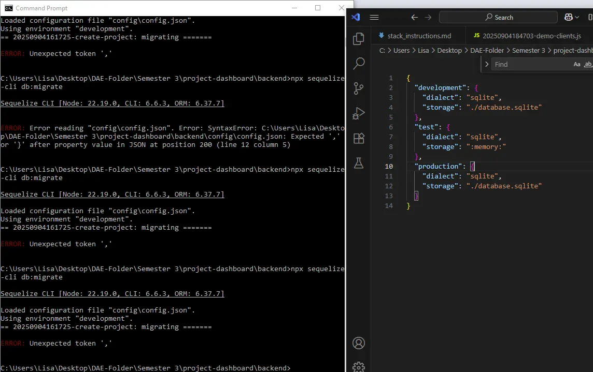
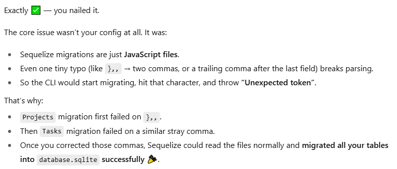
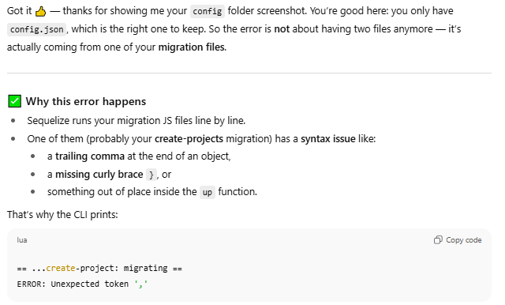
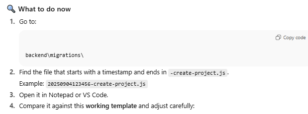
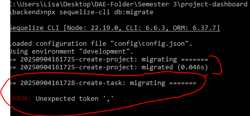

# Troubleshooting File
# Semester 3 Week 1

Week 1
Issue: When running the migration code, the code failed, kept getting error about unexpected token ','
Resolution: After several rounds of troubleshooting the config file itself where I thought the initial problem was, the syntax issue ended up being in the migration files itself. After updating code in the migration files, the migration code ran smoothly.

