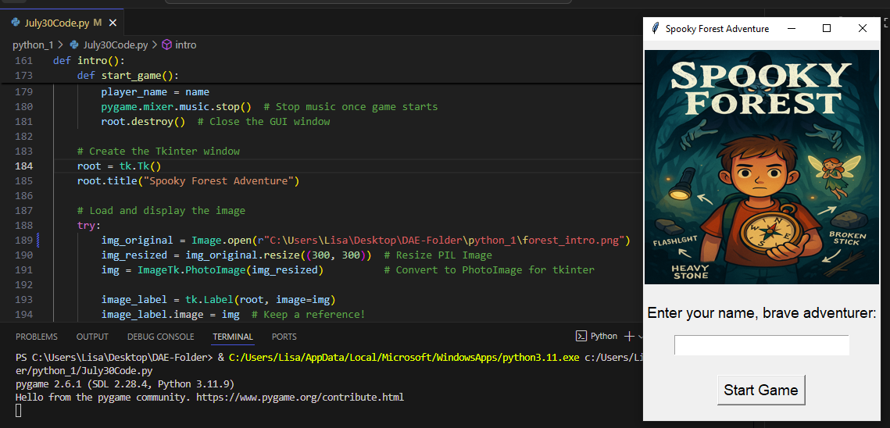
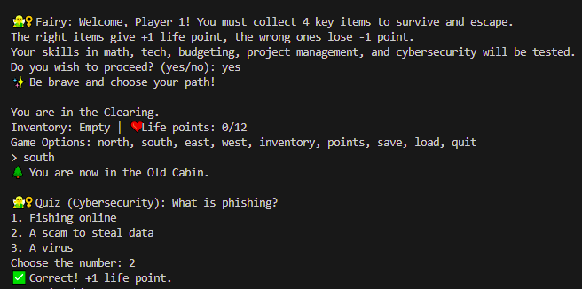
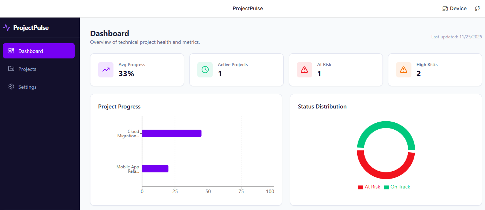
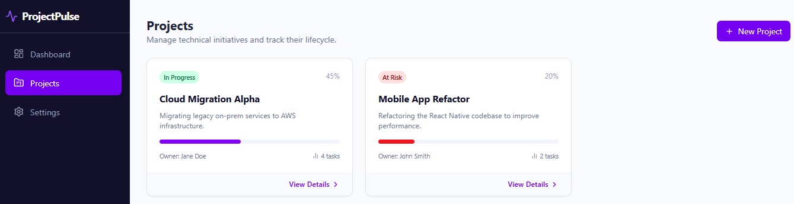
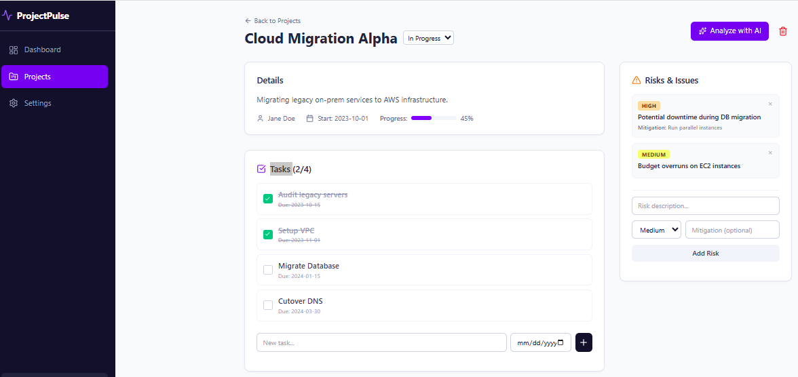

  <h2>Featured Projects</h2>
  
Here are some of the backend-focused projects I've developed to demonstrate practical engineering and system design skills.

## 📁 Adventure Game – Text based math and technology game for childern

## 📁 ProjectPulse – Full-Stack Project Management 

  
<strong>Tech Stack:</strong> Node.js, Express, SQLite, JWT, Next.js, ShadCN

  
<strong>Duration:</strong> 12 weeks | <strong>Status:</strong> In Development

A full-stack project management tool built to help teams track clients, projects, tasks, and files with secure authentication and reporting features.

**Key Features:**
- ⚙️ **Backend Architecture**: RESTful API with modular Express routes
- 🗄️ **Database Design**: Relational schema with SQLite and ER diagrams
- 🔐 **Authentication**: JWT-based login, registration, and protected routes
- 📁 **File Uploads**: Local storage with file path tracking in the database
- 📊 **Reporting API**: Aggregated data endpoints for weekly progress

**Frontend Highlights:**
- 🧩 **Next.js UI**: Minimal interface using ShadCN components
- 🔐 **Role-Based Access**: Conditional rendering and permission enforcement
- 🚀 **Deployment**: Vercel (backend) + Netlify (frontend)

---

## 🔐 Secure File Storage System

  
<strong>Tech Stack:</strong> Python, Flask, SQLAlchemy, AES-256 Encryption

  
<strong>Duration:</strong> 3 months | <strong>Status:</strong> Completed

Built a secure file storage system with end-to-end encryption and role-based access control.

**Key Features:**
- 🔒 AES-256 encryption for all stored files
- 👥 Admin/User/Guest roles with access restrictions
- 📝 Audit logging for compliance
- 🔑 JWT authentication with refresh tokens
- 🛡️ Input validation and security headers

---

## 🔍 API Security Scanner

  
<strong>Tech Stack:</strong> Go, REST APIs, JSON, Docker

  
<strong>Duration:</strong> 6 weeks | <strong>Status:</strong> Completed

Created a security scanner for REST APIs to detect vulnerabilities and misconfigurations.

**Scanning Capabilities:**
- 🔐 Authentication bypass detection
- 💉 SQL/NoSQL injection testing
- 🔓 Authorization flaws (IDOR, privilege escalation)
- 📝 Input fuzzing and boundary testing
- 🛡️ Security headers analysis

**Features:**
- CI/CD integration
- Custom rule engine
- Exportable reports (JSON, PDF, HTML)

---

  <h3>Want to Learn More?</h3>
  
These projects reflect my journey into backend development and my commitment to building secure, scalable systems. Each includes documentation, architecture decisions, and lessons learned.

  
<a href="/contact/" style="background:#007bff; color:white; padding:0.5rem 1rem; text-decoration:none; border-radius:4px;">Get in Touch</a>

  
  

    
  

